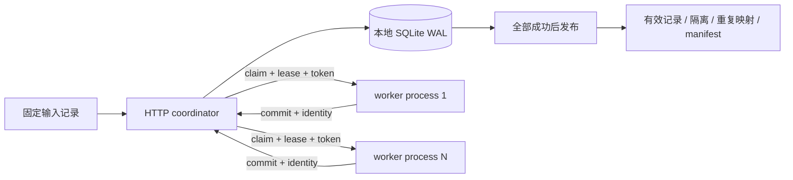

# 架构、状态与一致性边界

所有组件在一台机器。worker 只走 HTTP，不直接读写 SQLite。输入通过 HTTP 传给 worker，结果也通过 HTTP 返回，数据库由协调器持有。

## 状态机

`queued → leased → done`。租约到期时，下一次 claim 在事务内把分片转回 queued；达到最大尝试次数转 dead。dead 或未完成的 run 不能发布。`status` 是只读状态查询，不主动触发过期回收。

1. **领取**：`BEGIN IMMEDIATE` 序列化过期回收、任务选择和 attempt 递增。并发请求不能拿到同一个有效租约。
2. **续租**：必须匹配 run/shard/worker/token，且原租约仍有效。过期租约不能复活。worker 在转换后、提交前续租；超长任务超过租约会被丢弃并重试，没有后台 heartbeat。
3. **提交**：检查输入身份、规则版本、行 ID/来源哈希、结果结构和 lease；结果写入、done 状态和事件在一个事务提交。相同 token 和相同结果的重试返回 replayed，旧 token、不同 owner 或不同结果返回 409。
4. **发布**：仅所有分片 done 时进行。稳定 row_id 顺序确保重复数据保留者与完成顺序无关。canonical JSON 与 SHA-256 标识数据版本。manifest 在数据库保存，重复发布返回同一结果。

## 为什么这些条件都需要

| 机制 | 单独使用时的不足 | 本项目的处理 |
|---|---|---|
| 租约 | 老 worker 可能在新 worker 完成后返回 | attempt 单调递增，提交时 fencing |
| 幂等键 | 相同键可能对应不同输入或结果 | run 输入/config 身份绑定；相同提交必须同 digest |
| 重试 | poison task 可以无限循环 | max_attempts；耗尽后阻断发布 |
| 精确去重 | 并行完成顺序会影响保留记录 | 最终按 row_id 选择最早输入 |
| 哈希 | 只能说明字节/身份，不能证明语义正确 | 单独保留内容 oracle 和业务边界 |

## 保证及不保证

数据库事务保证已接受的分片只有一个结果；执行本身仍可能重复。SIGKILL 测试覆盖进程退出，不证明断电持久性。时钟使用协调器 wall clock，依赖其不发生剧烈跳变；未实现跨机器时钟或共识。SQLite 使用 FULL 同步与 WAL；单写者吞吐及最终聚合都会限制扩展。数据库必须位于本地磁盘。

技术依据：[SQLite transactions](https://www.sqlite.org/lang_transaction.html)、[SQLite WAL](https://www.sqlite.org/wal.html)、[SQLite isolation](https://www.sqlite.org/isolation.html)。HTTP 服务采用标准库实验服务，遵循 [Python 官方说明](https://docs.python.org/3.12/library/http.server.html)，不用于生产公网服务。

## API

均为 JSON POST。`/submit`：run、records、shard_size、max_attempts；`/claim`：run、worker、lease_seconds；`/renew`：run、shard、token、worker、lease_seconds；`/commit`：上述任务身份、input_sha256、rule、results；`/status` 与 `/publish`：run。

上限：输入 100,000 行，每片最多 1,000 行；HTTP 请求体最多 16 MiB。实际验证仅 1,200 行。`scripts/demo.py` 提供完整调用例子。单独启动：`python3 -m shardlab.server --db runs/state.sqlite --port 8765`，事先创建 runs 目录。
