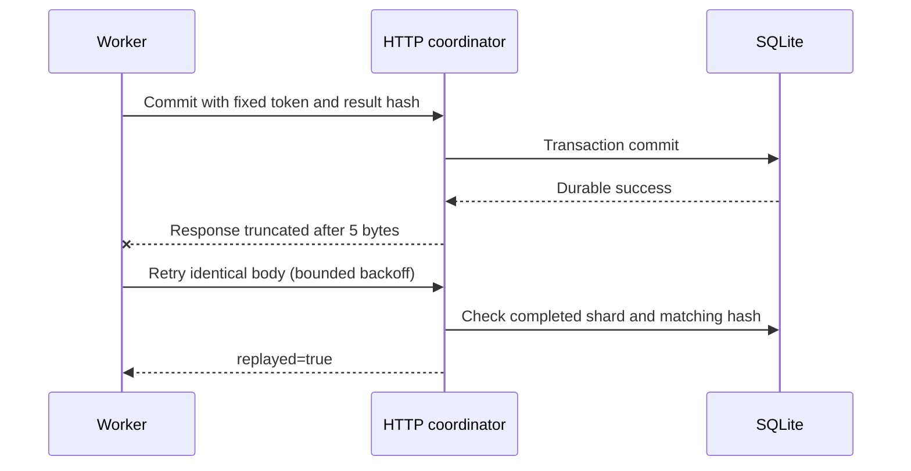

# 2026-09-19：提交响应截断后的重试

本次维护发生在既有实验之后；范围仍是单机 loopback HTTP 与合成记录。

发现：提交事务已经成功，但响应体在 Content-Length 声明长度之前断开时，客户端抛出 `http.client.IncompleteRead`，未进入原有连接错误重试。
修复：将此确定的传输中断纳入相同请求体的有限指数退避重试；最终失败仍抛出异常，409 fencing 行为不变。

`tests/test_lost_response.py` 启动真实 HTTP 服务，在 SQLite commit 后只发送 5 字节响应。客户端重试并收到 replay 确认；数据库恰有一次 committed 事件，发布结果恰有一条记录。该实验验证幂等提交，不代表任务只执行一次。原 SIGKILL、协调器重启、旧租约拒绝的 demo 继续运行。

旧 `evidence/local` 不变。`baseline/` 保留旧记录所引用的 worker 和核验器源码原字节，并按旧哈希核验；新故障运行记录当前源码哈希。

事务完成与客户端收到响应是两个不同事件。故障实验保留这两者之间的窗口，而不是只模拟提交前失败。

本次本地验证：28 项测试通过；命令和修改后源码摘要见 [validation.json](validation.json)。这不是未推送提交的远端 CI 结果。

[本次完整进程故障运行](evidence/fault-recovery-summary.json) 含 1,200 条输入、24 分片、1/4 worker 和故障组，发布 manifest 一致。计时仅供本机运行追溯，不作生产吞吐结论。
